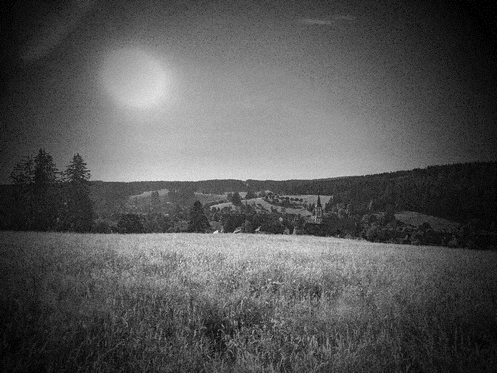

# Blue noise

A blue noise generator using the cluster and void algorithm by Robert Ulichney.

  * http://cv.ulichney.com/papers/1988-blue-noise.pdf
  * https://en.wikipedia.org/wiki/Colors_of_noise#Blue_noise

This is a pure javascript implementation. The web example works in chrome, the node example needs version v20.

## Some samples

These samples are generated using the default settings:

  * sigma = 1.5
  * initial points = 10%

### 16x16


### 32x32


### 64x64


### 128x128


### 256x256


## Image magick

Use the script `magick_threshold.js` to generate a `thresholds.xml` file or use the supplied example.

```
$> node magick_threshold.js > threshholds.xml
```

Copy the `thresholds.xml` file to the image magick config folder.

```
$> mkdir -p ~/.config/ImageMagick
$> cp thresholds.xml ~/.config/ImageMagick/
$> convert -list threshold
...
Map              Alias        Description
----------------------------------------------------
bn16x16                       Bluenoise dither map 16x16
bni16x16                      Bluenoise dither map inverse 16x16
bn32x32                       Bluenoise dither map 32x32
bni32x32                      Bluenoise dither map inverse 32x32
bn64x64                       Bluenoise dither map 64x64
bni64x64                      Bluenoise dither map inverse 64x64
bn128x128                     Bluenoise dither map 128x128
bni128x128                    Bluenoise dither map inverse 128x128
bn256x256                     Bluenoise dither map 256x256
bni256x256                    Bluenoise dither map inverse 256x256
```

Use the following command to dither an image:

```
$> convert tadaa_gray_50.jpg -ordered-dither bn64x64 y64.jpg
```

Example of a dithered image using `bn256x256`...



## Copyright

(c) 2023 Johan Van den Brande

```
  (\/)
 ( ..)
C(")(")
```
