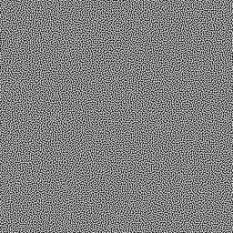

# Blue noise

A blue noise generator using the cluster and void algorithm by Robert Ulichney.

  * http://cv.ulichney.com/papers/1988-blue-noise.pdf
  * https://en.wikipedia.org/wiki/Colors_of_noise#Blue_noise

This is a pure javascript implementation. The web example works in chrome, the node example needs version v20.

## Some samples

These samples are generated using the default settings:

  * sigma = 1.5
  * initial points = 10%

### 16x16


### 32x32


### 64x64


### 128x128


### 256x256



## Copyright

(c) 2023 Johan Van den Brande

```
  (\/)
 ( ..)
C(")(")
```
